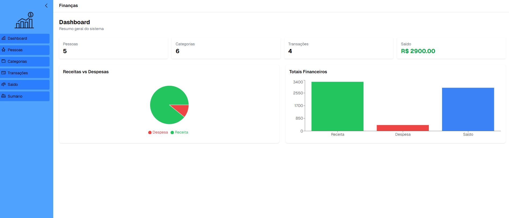
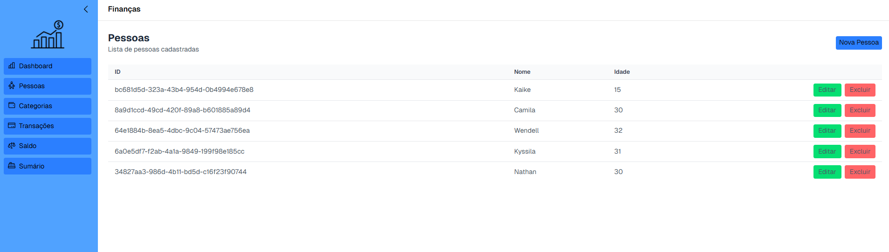
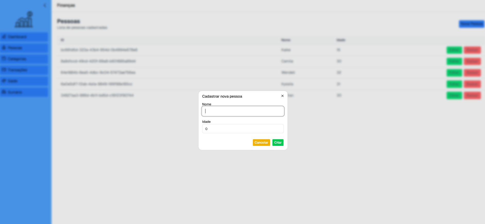
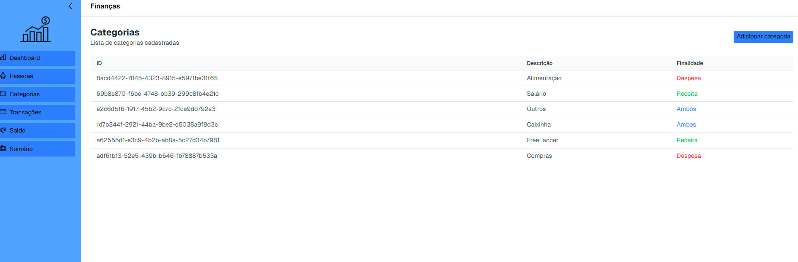
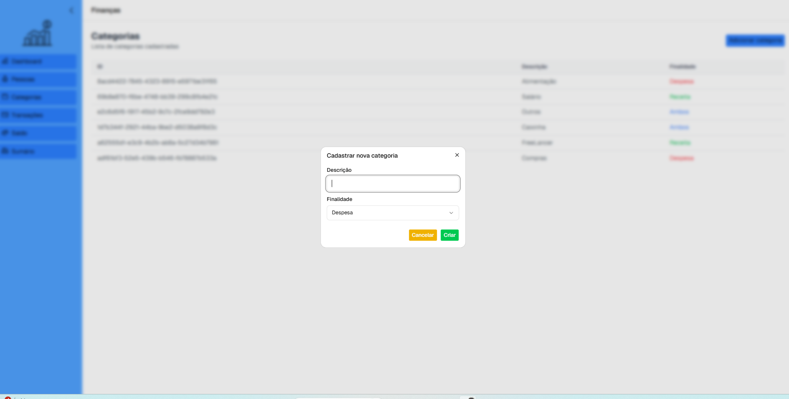
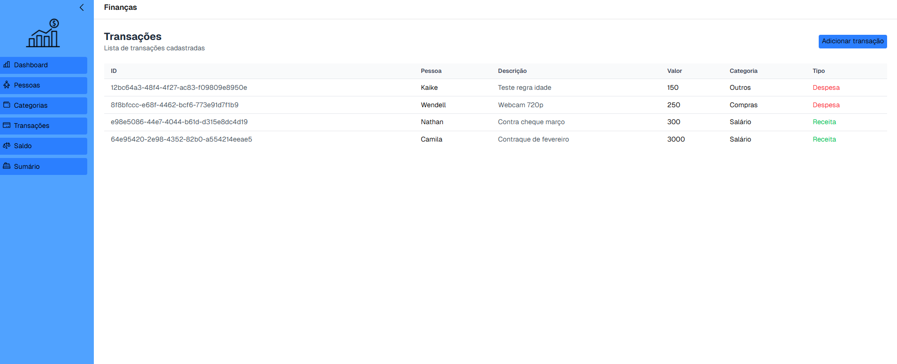
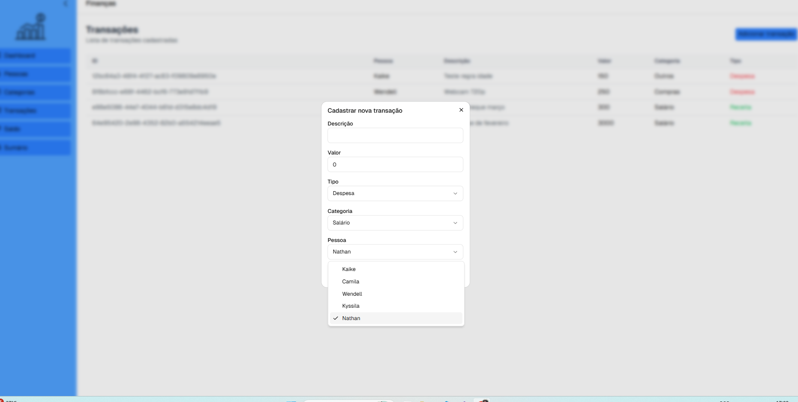
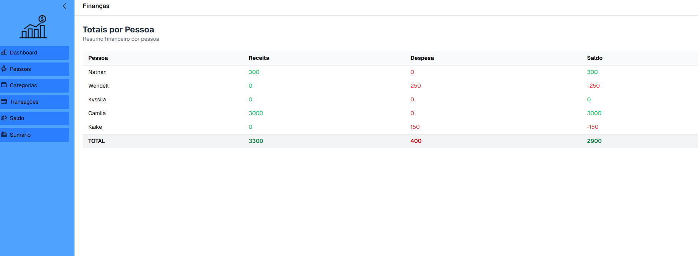
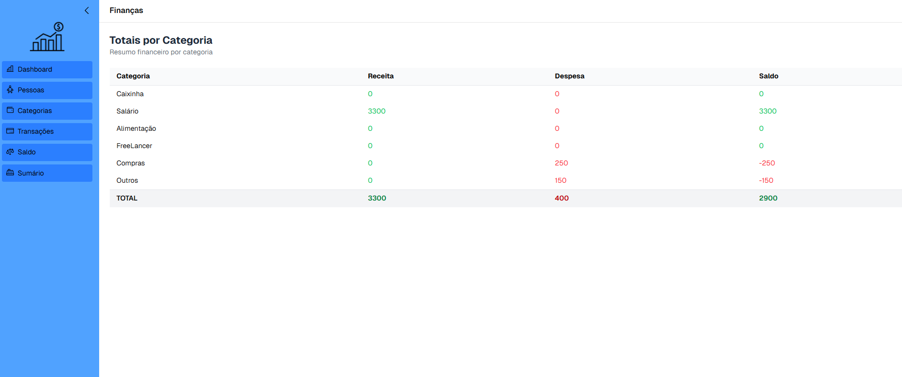

# FinancesApp

Aplicação front-end para controle de gastos residenciais, consumindo a API FinancesAPI.

## 🚀 Tecnologias

- React
- TypeScript
- Vite
- React Hook Form
- Zod
- TanStack Query
- ShadCN UI
- Recharts

## 📊 Funcionalidades

- Cadastro de pessoas, categorias e transações
- Dashboard com gráficos financeiros
- Totais por pessoa
- Totais por categoria
- Integração completa com API
- Atualização automática com React Query

## 🧠 Arquitetura

- **Pages**: telas principais
- **Components**: componentes reutilizáveis (tables, dialogs, charts)
- **Services**: integração com API (React Query)
- **Schemas**: validações com Zod
- **Constants**: enums e configs globais

## ⚙️ Como executar

- bash
- git clone https://github.com/Nathan-Barbosa/FinanceFrontend.git
- cd finances-app
- npm install
- npm run dev

## 📸 Prints da Aplicação

🏠 Dashboard

  

👤 Lista de Pessoas

  

➕ Criação de Pessoa

  

🗂️ Lista de Categorias

  

➕ Criação de Categoria

  

💰 Lista de Transações

  

➕ Criação de Transação

  

📊 Totais por Pessoa

  

📊 Totais por Categoria

  

